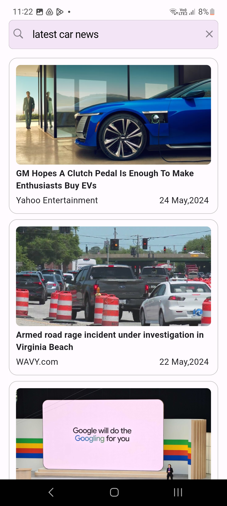

# News App

Welcome to the News App! This Flutter application provides users with a convenient way to stay updated on news articles. Users can browse news based on categories, search for specific news articles, and mark their favorite articles for later reference.

## Features

- Browse news articles by categories.
- Search for news articles based on user preferences.
- Mark favorite news articles.
- Integration with REST API for fetching news data.
- Use of Hive database for managing favorites.
- State management implemented using Bloc pattern.
- Simple and intuitive user interface.

## Installation

To run the News App on your device, follow these steps:

1. Clone this repository to your local machine:

    ```
    git clone https://github.com/your_username/news_app.git
    ```

2. Navigate to the project directory:

    ```
    cd news_app
    ```

3. Install dependencies using Flutter's package manager:

    ```
    flutter pub get
    ```

4. Add your News API key:
   
   In order to use the News API, you need to obtain an API key from [NewsAPI](https://newsapi.org/). Once you have the API key, follow these steps:

   - Open the file `lib/infrastructure/key/api_key.dart`.
   - Replace the value of `apiKey` with your actual News API key obtained from NewsAPI.

5. Run the app on your preferred device:

    ```
    flutter run
    ```

## Usage

Once the app is installed and running on your device, you can start exploring news articles immediately. Here's a brief overview of how to use the app:

- **Browse News:** Navigate through different categories to discover news articles.
- **Search News:** Use the search feature to find specific news articles based on keywords.
- **Mark Favorites:** Tap the heart icon to mark news articles as favorites.
- **View Favorites:** Access your favorite news articles from the favorites section.

## ScreenShot



